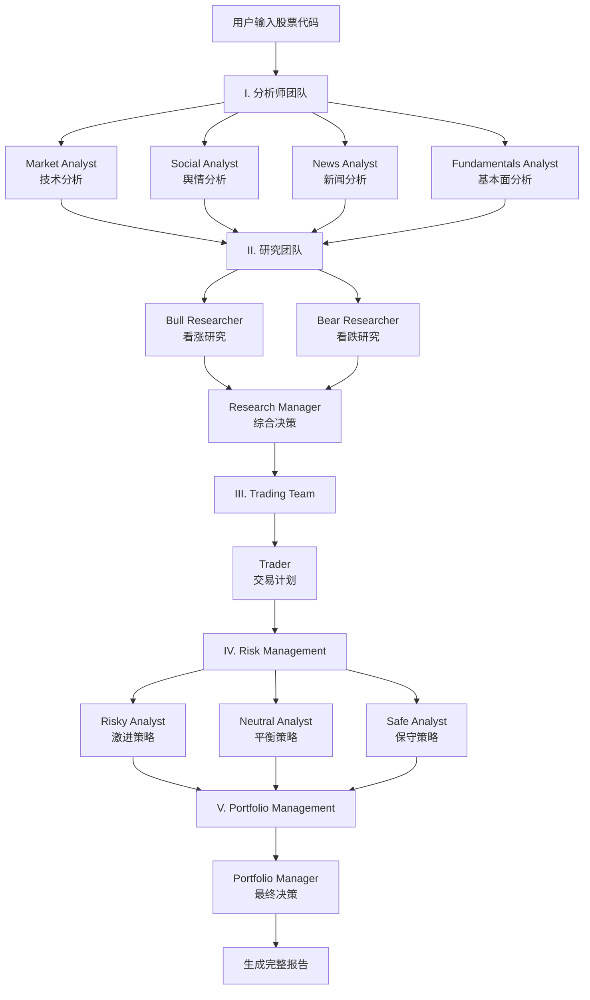

# TradingAgents CLI 系统使用说明

📅 **文档版本**: v1.0  
📍 **更新日期**: 2026-01-23  
🎯 **适用版本**: TradingAgents-AllInOne  

---

## 📖 目录

1. [系统概述](#系统概述)
2. [核心特性](#核心特性)
3. [快速开始](#快速开始)
4. [详细使用指南](#详细使用指南)
5. [配置说明](#配置说明)
6. [命令参考](#命令参考)
7. [智能体工作流](#智能体工作流)
8. [常见问题](#常见问题)

---

## 🚀 Docker CLI 快速参考 (TL;DR)

> **最常用的一键命令**（复制即用）

```bash
# 港股小米，新闻分析，DeepSeek
docker exec -it ta-app python -m cli.main analyze -t 01810.HK -m 3 -a news -p deepseek

# A股招商银行，市场+基本面，快速分析
docker exec -it ta-app python -m cli.main analyze -t 600036 -m 2 -a market -a fundamentals -l 1 -p dashscope

# 进入容器交互模式
docker exec -it ta-app bash
```

**参数速查**: `-t` 代码 | `-m` 市场(1美/2A/3港) | `-a` 分析师 | `-p` LLM提供商 | `-l` 深度(1-3)

---

## 系统概述

**TradingAgents CLI** 是一个功能强大的命令行金融分析工具，提供与Web前端完全一致的多智能体股票分析能力。

### 🎯 核心价值

- ✅ **完整功能**: 与Web前端共享相同的后端逻辑和数据源
- ✅ **精美界面**: 基于Rich库的现代化终端UI
- ✅ **实时反馈**: 动态显示智能体执行进度和分析结果
- ✅ **多市场支持**: 美股、A股、港股三大市场
- ✅ **高度可配置**: 灵活选择LLM提供商、智能体和分析深度

### 📂 文件位置

- **主程序**: `src/cli/main.py` (2157行)
- **工具模块**: `cli/utils.py`
- **数据模型**: `cli/models.py`
- **演示脚本**: `src/examples/cli_demo.py`

---

## 核心特性

### 1️⃣ **三大市场支持**

| 市场 | 代码格式 | 示例 | 数据源 |
|:---|:---|:---|:---|
| 🇺🇸 **美股** | 大写字母 (1-5位) | `SPY`, `AAPL`, `TSLA`, `NVDA` | Yahoo Finance |
| 🇨🇳 **A股** | 6位数字 | `600036` (招商银行), `000001` (平安银行) | AKShare + 东方财富 |
| 🇭🇰 **港股** | 代码.HK | `0700.HK` (腾讯), `09988.HK` (阿里) | Yahoo Finance |

### 2️⃣ **五大智能体团队**

```
┌─────────────────────────────────────────────────────────┐
│  I. 分析师团队 (Analyst Team)                            │
│     ├─ Market Analyst (市场分析师)                       │
│     ├─ Social Analyst (舆情分析师)                       │
│     ├─ News Analyst (新闻分析师)                         │
│     └─ Fundamentals Analyst (基本面分析师)               │
├─────────────────────────────────────────────────────────┤
│  II. 研究团队 (Research Team)                           │
│     ├─ Bull Researcher (看涨研究员)                     │
│     ├─ Bear Researcher (看跌研究员)                     │
│     └─ Research Manager (研究经理)                      │
├─────────────────────────────────────────────────────────┤
│  III. 交易团队 (Trading Team)                           │
│     └─ Trader (交易员)                                  │
├─────────────────────────────────────────────────────────┤
│  IV. 风险管理 (Risk Management)                         │
│     ├─ Risky Analyst (激进分析师)                       │
│     ├─ Neutral Analyst (中立分析师)                     │
│     └─ Safe Analyst (保守分析师)                        │
├─────────────────────────────────────────────────────────┤
│  V. 投资组合管理 (Portfolio Management)                 │
│     └─ Portfolio Manager (组合经理)                     │
└─────────────────────────────────────────────────────────┘
```

### 3️⃣ **数据源集成**

CLI系统使用与Web前端**完全相同**的数据源：

**新闻数据源** (14个一级源 + 14个子源):
- 东方财富、AKShare多源快讯 (7个子源)
- Serper实时搜索、Alpha Vantage
- RSS聚合 (7个子源)、MongoDB缓存
- Playwright爬虫 
**行情数据源** (13个):
- MongoDB、AKShare、yfinance、Finnhub
- Tushare、BaoStock、东方财富、新浪财经
- Alpha Vantage、IEX Cloud、Polygon.io等

### 4️⃣ **精美终端界面**

CLI使用 **Rich库** 实现现代化界面：

```
┌──────────────────────────────────────────────────────────┐
│                  Welcome to TradingAgents                │
│              多智能体大语言模型金融交易框架                 │
├──────────────────────┬───────────────────────────────────┤
│  Progress Panel      │  Messages & Tools Panel           │
│  ┌─────────────────┐ │ ┌───────────────────────────────┐ │
│  │ Team   Agent    │ │ │ Time  Type    Content         │ │
│  │ Analyst Market  │ │ │ 10:23 Tool    get_stock_data  │ │
│  │        Social   │ │ │ 10:24 Message Analyzing...    │ │
│  │        News     │ │ │ ...                           │ │
│  └─────────────────┘ │ └───────────────────────────────┘ │
├──────────────────────┴───────────────────────────────────┤
│  Current Report (Markdown渲染)                           │
│  ### Market Analysis                                     │
│  - Current Price: $XXX                                   │
│  - Technical Indicators: ...                             │
│  ...                                                     │
├──────────────────────────────────────────────────────────┤
│  Tool Calls: 45 | LLM Calls: 12 | Reports: 5            │
└──────────────────────────────────────────────────────────┘
```

### 5️⃣ **支持的LLM提供商**

- OpenAI (GPT-4, GPT-3.5)
- Anthropic (Claude系列)
- 阿里百炼 (通义千问)
- Google Gemini
- DeepSeek
- 其他兼容OpenAI API的服务

---

## 快速开始

> **💡 重要提示**：本项目是Docker项目，推荐使用Docker运行。CLI工具支持**本地运行**和**Docker容器内运行**两种方式。

---

## 🐳 Docker环境下使用CLI (推荐⭐⭐⭐)

### 📦 **前置条件**

确保Docker服务已启动：

```bash
# 启动所有服务
docker-compose up -d

# 检查容器状态
docker-compose ps

# 应该看到 ta-app 容器处于 running 状态
```

---

### 🎯 **方式一：Docker一键命令** (最快速⭐)

直接在**宿主机**执行，无需进入容器：

#### **基础语法**

```bash
docker exec -it ta-app python -m cli.main analyze [参数...]
```

#### **实战示例**

**港股01810，今天，新闻分析师，DeepSeek**：
```bash
docker exec -it ta-app python -m cli.main analyze \
  -t 01810.HK \
  -m 3 \
  -d $(date +%Y-%m-%d) \
  -a news \
  -p deepseek
```

**A股招商银行，快速分析，市场+基本面**：
```bash
docker exec -it ta-app python -m cli.main analyze \
  -t 600036 \
  -m 2 \
  -a market -a fundamentals \
  -p dashscope \
  -l 1
```

**美股苹果，深度分析，全部分析师**：
```bash
docker exec -it ta-app python -m cli.main analyze \
  -t AAPL \
  -m 1 \
  -a market -a news -a fundamentals -a social \
  -p openai \
  -l 3
```

**Windows PowerShell 用户**（换行符不同）：
```powershell
docker exec -it ta-app python -m cli.main analyze `
  -t 01810.HK `
  -m 3 `
  -a news `
  -p deepseek
```

---

### 🖥️ **方式二：进入容器交互模式**

适合需要多次执行或调试的场景：

#### **步骤1：进入容器**

```bash
docker exec -it ta-app bash
```

你会看到容器内的提示符：
```
root@xxxxx:/app#
```

#### **步骤2：运行CLI**

**交互式分析** (会提示你输入参数)：
```bash
python -m cli.main
```

**一键命令** (直接指定参数)：
```bash
python -m cli.main analyze \
  -t 01810.HK \
  -m 3 \
  -a news \
  -p deepseek
```

**查看帮助**：
```bash
python -m cli.main --help
python -m cli.main help
```

#### **步骤3：退出容器**

```bash
exit
```

---

### 📊 **方式三：查看实时日志**

启动分析后，在另一个终端查看日志：

```bash
# 查看所有日志
docker logs -f ta-app

# 只查看最近100行
docker logs --tail 100 -f ta-app

# 查看CLI专用日志（进入容器后）
docker exec -it ta-app tail -f /app/logs/cli.log
```

---

### 💾 **Docker环境下的数据持久化**

CLI分析结果会自动保存到Docker Volume：

```bash
# 查看数据卷
docker volume ls | grep ta

# 查看分析历史（需进入容器）
docker exec -it ta-app python -c "
from tradingagents.config.mongodb_storage import MongoDBStorage
storage = MongoDBStorage()
print(storage.get_recent_analyses(limit=5))
"
```

---

### 🔄 **Docker环境下的配置管理**

#### **修改环境变量**

1. 编辑宿主机的 `.env` 文件：
```bash
# 在宿主机编辑
nano .env  # 或 vim .env

# 修改API密钥
DEEPSEEK_API_KEY=sk-new-key...
```

2. 重启容器应用新配置：
```bash
docker-compose restart tradingagents
```

#### **查看当前配置**

```bash
docker exec -it ta-app python -m cli.main config
```

---

### 🛠️ **Docker环境常用命令速查**

| 操作 | 命令 |
|:---|:---|
| 查看容器状态 | `docker-compose ps` |
| 启动服务 | `docker-compose up -d` |
| 停止服务 | `docker-compose down` |
| 重启应用 | `docker-compose restart tradingagents` |
| 进入容器 | `docker exec -it ta-app bash` |
| 查看日志 | `docker logs -f ta-app` |
| 更新镜像 | `docker-compose pull && docker-compose up -d` |
| 清理重建 | `docker-compose down -v && docker-compose up -d` |

---

## 💻 本地环境下使用CLI (不使用Docker)

### 🚀 **方式一：直接运行分析**

```bash
# 进入项目目录
cd d:\anti\TradingAgents-AllInOne

# 运行CLI主程序
python -m cli.main

# 或者直接运行
python src/cli/main.py
```

### 📋 **方式二：使用演示脚本**

```bash
# 查看CLI功能演示
python src/examples/cli_demo.py
```

### ⚙️ **首次使用前准备**

1. **配置环境变量** (`.env` 文件):
```env
# 必选：至少配置一个LLM提供商
OPENAI_API_KEY=sk-xxx...
ANTHROPIC_API_KEY=sk-ant-xxx...
DASHSCOPE_API_KEY=sk-xxx...

# 可选：增强功能
SERPER_API_KEY=xxx...          # Google搜索API
ALPHA_VANTAGE_API_KEY=xxx...   # 美股新闻
FINNHUB_API_KEY=xxx...         # 美股数据
```

2. **安装依赖**:
```bash
pip install -r requirements.txt
```

3. **启动MongoDB** (如需使用历史数据):
```bash
docker-compose up -d tradingagents-mongodb
```

### 🎯 **方式三：一键命令模式** ⭐

CLI支持命令行参数，可跳过交互式流程直接执行分析！

#### **你要的命令** (港股01810，今天，新闻分析师，DeepSeek)：

```bash
python -m cli.main analyze \
  --ticker 01810.HK \
  --market 3 \
  --date 2026-01-23 \
  --analysts news \
  --provider deepseek
```

#### **完整参数表**

| 参数 | 短参数 | 说明 | 可选值 / 格式 | 示例 |
|:---|:---|:---|:---|:---|
| `--ticker` | `-t` | 股票代码 | 按市场格式 | `01810.HK`, `600036`, `AAPL` |
| `--market` | `-m` | 市场类型 | `1`=美股, `2`=A股, `3`=港股 | `3` |
| `--date` | `-d` | 分析日期 | `YYYY-MM-DD` | `2026-01-23` |
| `--analysts` | `-a` | 分析师 (可重复) | `market`, `news`, `fundamentals`, `social` | `-a news -a market` |
| `--depth` | `-l` | 研究深度 | `1`=快速, `2`=标准, `3`=深度 | `2` |
| `--provider` | `-p` | LLM提供商 | `deepseek`, `openai`, `anthropic`, `dashscope`, `google` | `deepseek` |

#### **更多一键命令示例**

**A股快速分析** (招商银行，市场+基本面，DeepSeek)：
```bash
python -m cli.main analyze \
  -t 600036 \
  -m 2 \
  -a market -a fundamentals \
  -p deepseek \
  -l 1
```

**美股深度分析** (苹果，所有分析师，OpenAI)：
```bash
python -m cli.main analyze \
  --ticker AAPL \
  --market 1 \
  --analysts market \
  --analysts news \
  --analysts fundamentals \
  --analysts social \
  --depth 3 \
  --provider openai
```

**港股标准分析** (腾讯，今天，新闻，阿里百炼)：
```bash
python -m cli.main analyze \
  -t 0700.HK \
  -m 3 \
  -d $(date +%Y-%m-%d) \
  -a news \
  -p dashscope
```

**快捷写法** (使用短参数)：
```bash
# 港股小米，新闻分析，DeepSeek
python -m cli.main analyze -t 01810.HK -m 3 -a news -p deepseek

# A股宁德时代，全部分析师，阿里百炼
python -m cli.main analyze -t 300750 -m 2 -a market -a news -a fundamentals -a social -p dashscope
```

---

## 详细使用指南

### 📊 **完整分析流程** (交互式)

运行 `python -m cli.main` 后，系统会引导你完成7个步骤：

#### **步骤 1: 选择市场**

```
请选择股票市场 | Please select stock market:
1. 🌍 美股 | US Stock
   示例 | Examples: SPY, AAPL, TSLA

2. 🌍 A股 | China A-Share  
   示例 | Examples: 000001 (平安银行), 600036 (招商银行)

3. 🌍 港股 | Hong Kong Stock
   示例 | Examples: 0700.HK (腾讯), 09988.HK (阿里巴巴)

请选择市场 | Select market [2]: 
```

#### **步骤 2: 输入股票代码**

```
A股股票示例 | China A-Share Examples:
  • 000001 (平安银行)
  • 600036 (招商银行)
  • 000858 (五粮液)

格式要求 | Format: 6位数字代码 (如: 600036, 000001)

请输入A股股票代码 | Enter China A-Share ticker [600036]:
```

**验证规则**:
- 美股: 1-5位大写字母 (`^[A-Z]{1,5}$`)
- A股: 6位数字 (`^\d{6}$`)
- 港股: 代码.HK (`^\d{4,5}\.HK$`)

#### **步骤 3: 分析日期**

```
请输入分析日期 (YYYY-MM-DD) | Enter the analysis date (YYYY-MM-DD)

请输入分析日期 | Enter analysis date [2026-01-23]:
```

**注意**: 不能选择未来日期

#### **步骤 4: 选择分析师团队**

```
选择您的LLM分析师智能体进行分析 | Select your LLM analyst agents

可用的分析师 | Available analysts:
1. Market Analyst (市场分析师) - 技术分析、价格走势
2. Social Analyst (舆情分析师) - 社交媒体情绪
3. News Analyst (新闻分析师) - 新闻事件分析
4. Fundamentals Analyst (基本面分析师) - 财务报表分析

请输入分析师编号 (用逗号分隔) | Enter analyst numbers (comma separated) [1,2,3,4]:
```

#### **步骤 5: 研究深度**

```
选择您的研究深度级别 | Select your research depth level:

1. 🚀 Quick (快速) - 基础分析，5-10分钟
2. 📊 Standard (标准) - 完整分析，15-20分钟  
3. 🔬 Deep (深度) - 全面研究，30-45分钟

请选择 | Select [2]:
```

#### **步骤 6: LLM提供商**

```
选择要使用的LLM服务 | Select which LLM service to use:

1. OpenAI (GPT-4/GPT-3.5)
2. Anthropic (Claude)
3. 阿里百炼 (通义千问)
4. Google Gemini
5. DeepSeek

请选择 | Select [1]:
```

#### **步骤 7: 思考智能体**

```
选择您的思考智能体进行分析 | Select your thinking agents:

浅层思考智能体 (Shallow Thinker):
1. gpt-4o
2. gpt-4o-mini
3. gpt-3.5-turbo

请选择 | Select [1]:

深层思考智能体 (Deep Thinker):
1. o1
2. o1-mini
3. o3-mini

请选择 | Select [1]:
```

---

### 🎬 **分析执行阶段**

完成配置后，CLI会自动启动实时分析界面：

```
┌─────────────────────────────────────────────────────────────┐
│           Welcome to TradingAgents CLI                      │
│  © Tauric Research (https://github.com/TauricResearch)     │
├──────────────────┬──────────────────────────────────────────┤
│ Progress         │ Messages & Tools                         │
│ ┌──────────────┐ │ ┌──────────────────────────────────────┐ │
│ │Team    Agent │ │ │Time  Type    Content                 │ │
│ │Analyst Market│ │ │10:23 Tool    get_stock_quotes        │ │
│ │       ●●●    │ │ │10:24 Tool    get_technical_indicator │ │
│ │Social pending│ │ │10:25 Message Analyzing market trend  │ │
│ │News   pending│ │ │...                                   │ │
│ └──────────────┘ │ └──────────────────────────────────────┘ │
├──────────────────┴──────────────────────────────────────────┤
│ Current Report                                              │
│ ### Market Analysis                                         │
│ **Symbol**: 600036 (招商银行)                                │
│ **Current Price**: ¥42.35                                   │
│ **Daily Change**: +1.23% ↗                                  │
│                                                             │
│ **Technical Indicators**:                                   │
│ - RSI(14): 58.3 (中性)                                      │
│ - MACD: 看涨信号                                            │
│ - 均线: 多头排列                                             │
│ ...                                                         │
├─────────────────────────────────────────────────────────────┤
│ Tool Calls: 12 | LLM Calls: 4 | Generated Reports: 1       │
└─────────────────────────────────────────────────────────────┘
```

**界面元素说明**:

1. **Progress Panel** (左上):
   - 显示5大团队的执行状态
   - `pending`: 等待执行
   - `in_progress`: 正在执行 (带旋转动画)
   - `completed`: 已完成 ✅
   - `error`: 执行出错 ❌

2. **Messages & Tools** (右上):
   - 实时显示工具调用记录
   - 显示LLM推理消息
   - 滚动显示最近12条记录

3. **Current Report** (下方):
   - Markdown格式渲染
   - 实时更新最新生成的报告段落
   - 支持表格、列表、代码块等格式

4. **Footer** (底部):
   - 统计工具调用次数
   - 统计LLM调用次数
   - 统计生成报告数

---

### 📄 **最终报告展示**

分析完成后，CLI会展示完整的五部分报告：

```
┌─────────────────────────────────────────────────────────┐
│ I. Analyst Team Reports                                 │
├──────────────┬──────────────┬──────────────┬────────────┤
│Market Analyst│Social Analyst│News Analyst  │Fundamentals│
│              │              │              │Analyst     │
│### 技术分析   │### 舆情摘要   │### 新闻事件   │### 财务数据 │
│...           │...           │...           │...         │
└──────────────┴──────────────┴──────────────┴────────────┘

┌─────────────────────────────────────────────────────────┐
│ II. Research Team Decision                              │
├──────────────┬──────────────┬──────────────────────────┤
│Bull          │Bear          │Research Manager          │
│Researcher    │Researcher    │                          │
│### 看涨理由   │### 看跌风险   │### 综合决策              │
│...           │...           │...                       │
└──────────────┴──────────────┴──────────────────────────┘

┌─────────────────────────────────────────────────────────┐
│ III. Trading Team Plan                                  │
│ ### 交易计划                                             │
│ - 建议操作: 买入/持有/卖出                                │
│ - 目标价格: ...                                          │
│ - 止损位: ...                                            │
└─────────────────────────────────────────────────────────┘

┌─────────────────────────────────────────────────────────┐
│ IV. Risk Management Team Decision                       │
├──────────────┬──────────────┬──────────────────────────┤
│Aggressive    │Neutral       │Conservative              │
│Analyst       │Analyst       │Analyst                   │
│### 激进策略   │### 平衡策略   │### 保守策略              │
│...           │...           │...                       │
└──────────────┴──────────────┴──────────────────────────┘

┌─────────────────────────────────────────────────────────┐
│ V. Portfolio Manager Decision                           │
│ ### 最终投资决策                                          │
│ - 综合评分: X/10                                         │
│ - 推荐仓位: X%                                           │
│ - 风险等级: 高/中/低                                      │
│ - 投资建议: ...                                          │
└─────────────────────────────────────────────────────────┘
```

---

## 配置说明

### 🔧 **环境变量配置** (`.env`)

#### **必选配置** (至少一个LLM提供商)

```env
# OpenAI
OPENAI_API_KEY=sk-proj-xxx...
OPENAI_BASE_URL=https://api.openai.com/v1  # 可选，自定义端点

# Anthropic Claude
ANTHROPIC_API_KEY=sk-ant-xxx...

# 阿里百炼
DASHSCOPE_API_KEY=sk-xxx...

# Google Gemini
GOOGLE_API_KEY=xxx...

# DeepSeek
DEEPSEEK_API_KEY=sk-xxx...
```

#### **可选配置** (增强功能)

```env
# Serper (Google搜索API，增强新闻获取)
SERPER_API_KEY=xxx...

# Alpha Vantage (美股新闻和基本面数据)
ALPHA_VANTAGE_API_KEY=xxx...

# Finnhub (美股实时数据)
FINNHUB_API_KEY=xxx...

# MongoDB连接 (默认值如下)
MONGODB_URI=mongodb://localhost:27017
MONGODB_DB_NAME=tradingagents

# Redis连接 (缓存加速)
REDIS_HOST=localhost
REDIS_PORT=6379
```

### 📝 **配置文件** (`config/config.yaml`)

系统会自动从MongoDB加载配置，也可手动编辑YAML文件：

```yaml
llm_providers:
  openai:
    api_key: ${OPENAI_API_KEY}
    default_model: gpt-4o
    
  anthropic:
    api_key: ${ANTHROPIC_API_KEY}
    default_model: claude-3-5-sonnet-20241022

data_sources:
  china_stock:
    enabled: true
    providers: [akshare, tushare, baostock]
    
  us_stock:
    enabled: true
    providers: [yfinance, finnhub, alpha_vantage]
```

---

## 命令参考

### 🎯 **主命令**

```bash
# 启动交互式分析
python -m cli.main

# 或
python src/cli/main.py
```

### 📖 **帮助命令**

```bash
# 显示命令行帮助
python -m cli.main --help

# 显示详细中文帮助
python -m cli.main help
```

### ⚙️ **配置命令**

```bash
# 显示当前配置
python -m cli.main config

# 显示可用的LLM提供商
python -m cli.main providers

# 测试API密钥
python -m cli.main test
```

### 📦 **其他命令**

```bash
# 显示版本信息
python -m cli.main version

# 显示示例程序
python -m cli.main examples

# 运行系统测试
python -m cli.main test
```

---

## 智能体工作流

### 🔄 **完整执行流程**



### ⏱️ **预计执行时间**

| 研究深度 | 预计时间 | 说明 |
|:---|:---|:---|
| 🚀 Quick | 5-10分钟 | 快速分析，基础技术指标 + 重点新闻 |
| 📊 Standard | 15-20分钟 | 标准分析，完整数据 + 深度新闻 + 基本面 |
| 🔬 Deep | 30-45分钟 | 全面研究，历史回测 + 行业对比 + 详细财报 |

**影响因素**:
- LLM响应速度
- 网络延迟
- 数据源可用性
- 选择的分析师数量

---

## 常见问题

### ❓ **Q1: CLI和Web前端有什么区别？**

**A**: 功能完全一致，区别仅在界面形式：

| 特性 | CLI | Web前端 |
|:---|:---|:---|
| 智能体工作流 | ✅ 完全相同 | ✅ 完全相同 |
| 数据源 | ✅ 完全相同 | ✅ 完全相同 |
| 分析深度 | ✅ 完全相同 | ✅ 完全相同 |
| 界面形式 | 终端UI | 浏览器UI |
| 实时进度 | Rich动画 | SSE流式更新 |
| 报告展示 | Markdown渲染 | HTML渲染 |

---

### ❓ **Q2: 如何加快分析速度？**

**A**: 几种优化方案：

1. **使用缓存**:
```env
REDIS_HOST=localhost  # 启用Redis缓存
```

2. **减少分析师数量**:
```
只选择关键分析师，如: 1,4 (Market + Fundamentals)
```

3. **选择快速思考模型**:
```
Shallow Thinker: gpt-4o-mini
Deep Thinker: o3-mini
```

4. **预先同步数据**:
```bash
python src/scripts/sync_stock_data.py --symbol 600036
```

---

### ❓ **Q3: CLI分析失败怎么办？**

**A**: 检查步骤：

1. **查看日志**:
```bash
# 日志位置
tail -f logs/cli.log
```

2. **验证API密钥**:
```bash
python -m cli.main test
```

3. **检查数据源连通性**:
```bash
# 测试MongoDB
docker exec -it tradingagents-mongodb mongosh

# 测试外部API
curl "https://api.openai.com/v1/models" -H "Authorization: Bearer $OPENAI_API_KEY"
```

4. **常见错误**:

| 错误信息 | 原因 | 解决方案 |
|:---|:---|:---|
| `API key not found` | 未配置API密钥 | 检查 `.env` 文件 |
| `Connection refused` | 服务未启动 | 启动 MongoDB/Redis |
| `Rate limit exceeded` | API配额用尽 | 等待或切换提供商 |
| `Invalid ticker format` | 股票代码格式错误 | 参考格式说明重新输入 |

---

### ❓ **Q4: 如何保存分析报告？**

**A**: CLI会自动保存分析历史到MongoDB：

```python
# 查询历史报告
from tradingagents.config.mongodb_storage import MongoDBStorage
storage = MongoDBStorage()

# 获取最近的分析
recent_analyses = storage.get_recent_analyses(symbol="600036", limit=10)
```

**手动导出**:
```bash
# 导出为JSON
python src/scripts/export_analysis.py --symbol 600036 --format json

# 导出为PDF (需配置)
python src/scripts/export_analysis.py --symbol 600036 --format pdf
```

---

### ❓ **Q5: CLI支持批量分析吗？**

**A**: 可以通过脚本实现批量分析：

```python
# batch_analyze.py
from cli.main import run_analysis

stocks = ["600036", "000001", "000858"]

for symbol in stocks:
    config = {
        "ticker": symbol,
        "market": {"data_source": "china_stock"},
        "analysts": ["market", "fundamentals"],
        "research_depth": "quick"
    }
    run_analysis(config)
```

---

### ❓ **Q6: 日志在哪里？**

**A**: 日志文件位置：

```
logs/
├── cli.log              # CLI主日志
├── tradingagents.log    # 后端日志
├── data_sources.log     # 数据源日志
└── llm_calls.log        # LLM调用日志
```

**查看实时日志**:
```bash
# 查看CLI日志
tail -f logs/cli.log

# 查看所有日志
tail -f logs/*.log
```

---

## 📞 技术支持

- **GitHub**: https://github.com/TauricResearch/TradingAgents-AllInOne
- **Issues**: https://github.com/TauricResearch/TradingAgents-AllInOne/issues
- **文档**: 查看 `docs/` 目录

---

## 📜 许可证

本项目遵循项目主许可证。详见 `LICENSE` 文件。

---

**🎉 Happy Trading with TradingAgents CLI! 🚀**
