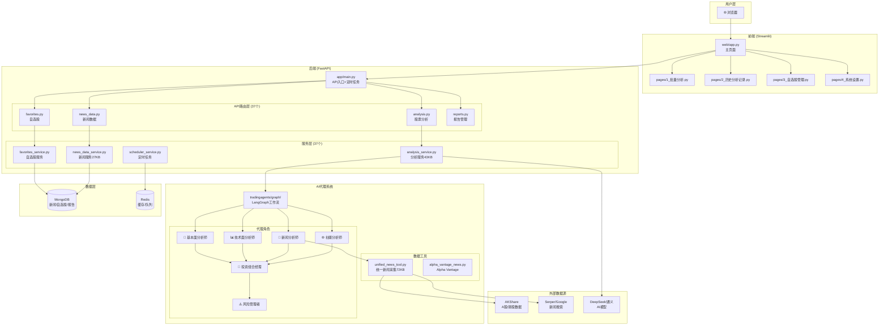
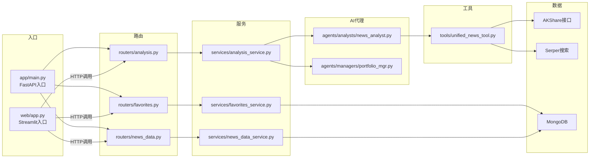

# TradingAgents-CN 项目架构图

## 📊 项目规模统计

| 分类 | 数量 |
|------|------|
| **总.py文件** | 106个 |
| 后端API路由 | 37个 |
| 后端服务层 | 37个 |
| AI代理模块 | 19个 |
| 前端页面 | 4个 |

---

## 🏗️ 核心目录结构

```
/anti/ak-trading/TradingAgents-arm32/
├── app/                    # 🔵 FastAPI后端 (主力)
│   ├── main.py            # 入口：840行，启动FastAPI+定时任务
│   ├── routers/           # API路由层 (37个.py)
│   ├── services/          # 业务服务层 (37个.py)
│   ├── worker/            # 后台任务 (AKShare同步等)
│   └── models/            # 数据模型
│
├── tradingagents/         # 🤖 AI代理核心
│   ├── agents/            # 代理系统
│   │   ├── analysts/      # 分析师代理 (5个)
│   │   ├── managers/      # 管理者代理 (2个)
│   │   ├── traders/       # 交易员代理 (1个)
│   │   └── risk_mgmt/     # 风控代理 (3个)
│   ├── tools/             # 数据工具
│   │   └── unified_news_tool.py  # 统一新闻采集 (72KB)
│   └── graph/             # LangGraph工作流
│
├── web/                   # 🌐 Streamlit前端
│   ├── app.py             # 主页面 (1927行)
│   └── pages/             # 子页面 (4个)
│       ├── 1_批量分析.py
│       ├── 2_历史分析记录.py
│       ├── 3_自选股管理.py
│       └── 4_系统设置.py
│
└── frontend/              # 📱 静态前端 (备用)
    └── static/index.html
```

---

## 🔄 运行流程架构图



---

## 📜 核心.py文件关系

### 入口文件 → 模块调用链



---

## 🔑 核心文件说明

### 后端入口 (app/main.py)
- **行数**: 840行
- **职责**: 
  - 创建FastAPI应用
  - 注册37个API路由
  - 启动APScheduler定时任务（新闻同步、数据更新）
  - 数据库初始化

### 前端入口 (web/app.py)
- **行数**: 1927行  
- **职责**:
  - Streamlit主页面
  - 股票分析表单
  - 调用后端API

### AI分析核心 (services/analysis_service.py)
- **大小**: 43KB
- **职责**:
  - 调用LangGraph工作流
  - 协调6个AI代理
  - 生成分析报告

### 新闻数据采集 (tools/unified_news_tool.py)
- **大小**: 72KB (项目最大.py文件)
- **职责**:
  - 多源新闻采集（AKShare、Serper、Alpha Vantage）
  - 港股/A股/美股适配
  - 数据去重和格式化

---

## 📁 按功能分类的.py文件数量

| 功能模块 | 文件数 | 主要文件 |
|----------|--------|----------|
| **API路由** | 37 | analysis.py, favorites.py, news_data.py |
| **业务服务** | 37 | analysis_service.py, favorites_service.py |
| **AI代理** | 11 | news_analyst.py, portfolio_mgr.py |
| **数据工具** | 4 | unified_news_tool.py |
| **配置管理** | 9 | config_service.py, default_config.py |
| **测试脚本** | 约30 | test_*.py (项目根目录) |

---

## 🚀 典型请求流程示例

**用户分析01810.HK的完整流程**:

```
1. 用户操作: web/app.py → 输入"01810"
         ↓
2. HTTP请求: POST /api/analysis/analyze
         ↓
3. 路由处理: routers/analysis.py → 验证参数
         ↓
4. 服务调用: services/analysis_service.py → 启动分析
         ↓
5. AI工作流: tradingagents/graph/ → LangGraph编排
         ↓
6. 代理运行:
   - 新闻分析师 → tools/unified_news_tool.py → AKShare/Serper
   - 基本面分析师 → AKShare财务数据
   - 技术面分析师 → AKShare K线数据
         ↓
7. 管理者汇总: agents/managers/portfolio_mgr.py
         ↓
8. 风险评估: agents/risk_mgmt/
         ↓
9. 报告输出: 保存到MongoDB → 返回前端
```

---

生成时间: 2026-01-17 08:45
